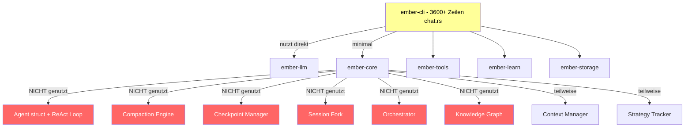

# 🔥 Ember — Vollständige Codebase-Analyse & Verbesserungsplan

> Analyse basierend auf vollständiger Code-Review aller 16 Workspace-Crates (April 2026)

## Zusammenfassung

Ember ist ein ambitioniertes Rust-basiertes AI-Agent-Framework mit **16 Crates**, 10+ LLM-Providern, Tool-System, MCP-Integration, Learning-System, TUI, Web-Dashboard und mehr. Die Architektur ist beeindruckend — aber es gibt eine **fundamentale Diskrepanz**: `ember-core` enthält ausgefeilte Infrastruktur, die von der CLI größtenteils **nicht genutzt** wird. Die CLI hat stattdessen eine eigene, vereinfachte Version in einer 3.600-Zeilen-Monolith-Datei.

Dieses Dokument identifiziert **15 konkrete Verbesserungsbereiche**, geordnet nach Schweregrad.

---

## Architektur-Übersicht

**Rot = toter Code / nicht integriert, Gelb = überdimensioniert**

---

## 🔴 Kritisch — Architektur-Probleme

### 1. chat.rs ist ein 3.600-Zeilen-Monolith der ember-core::Agent umgeht

**Problem:**
- [`chat.rs`](crates/ember-cli/src/commands/chat.rs:1) enthält die *gesamte* Agent-Runtime: REPL-Loop, Tool-Ausführung, Session-Persistenz, Slash-Commands, Progress-Indikatoren, Provider-Erstellung, Risiko-Klassifizierung
- [`Agent::chat()`](crates/ember-core/src/agent.rs:133) in ember-core implementiert einen vollständigen ReAct-Loop mit Tool-Execution — wird aber **nie aufgerufen**
- Die CLI importiert von ember-core nur [`SessionUsageTracker`](crates/ember-cli/src/commands/chat.rs:76), [`StrategyTracker`](crates/ember-cli/src/commands/chat.rs:2008), [`ContextBudget`](crates/ember-cli/src/commands/chat.rs:2011) und [`RiskTier`](crates/ember-cli/src/commands/risk.rs:21)

**Auswirkung:** Doppelte Implementierung der Kernlogik. Verbesserungen am Agent müssen an zwei Stellen gemacht werden.

**Lösung:**
- chat.rs in 5-6 fokussierte Module aufteilen (teilweise schon geschehen: `risk.rs`, `session.rs`, `display.rs`, `provider_factory.rs`, `terminal.rs`)
- `agent_interactive()` und `agent_one_shot()` auf `ember-core::Agent` umstellen
- Event-basiertes System für CLI-Display einführen — z.B. `AgentEvents` trait

### 2. Große Teile von ember-core sind toter Code

**Problem:**
Folgende Module in ember-core sind vollständig implementiert aber nirgendwo integriert:

| Modul | Zeilen | Status |
|-------|--------|--------|
| [`agent.rs`](crates/ember-core/src/agent.rs) | 473 | Agent Loop nie aufgerufen |
| [`checkpoint.rs`](crates/ember-core/src/checkpoint.rs) | ? | Nie integriert in Chat |
| [`session_fork.rs`](crates/ember-core/src/session_fork.rs) | ? | Slash-Command existiert, Backend nicht verbunden |
| [`knowledge_graph.rs`](crates/ember-core/src/knowledge_graph.rs) | ? | Nie benutzt |
| [`orchestrator.rs`](crates/ember-core/src/orchestrator.rs) | ? | Multi-Agent nie benutzt |
| [`collaboration.rs`](crates/ember-core/src/collaboration.rs) | ? | Nie benutzt |
| [`planning.rs`](crates/ember-core/src/planning.rs) | ? | Nie benutzt |
| [`context_manager.rs`](crates/ember-core/src/context_manager.rs) | 834 | ContextManagerV2 nie benutzt |

**Auswirkung:** Aufgeblähte Binary-Größe, verwirrende Doppel-Strukturen, Wartungsaufwand für Code der nie ausgeführt wird.

**Lösung:** Entweder integrieren oder hinter Feature-Flags verstecken / entfernen.

### 3. Veraltete Default-Modelle in LLM-Providern

**Problem:**
- [`anthropic.rs`](crates/ember-llm/src/anthropic.rs:17): Default-Modell ist `claude-3-5-sonnet-20241022` — veraltet, sollte `claude-sonnet-4-20250514` oder mindestens `claude-3-7-sonnet` sein
- [`gemini.rs`](crates/ember-llm/src/gemini.rs:19): Default ist `gemini-2.0-flash-exp` — "exp" deutet auf experimental hin
- Andere Provider sollten ebenfalls geprüft werden

**Lösung:** Alle DEFAULT_MODEL-Konstanten auf aktuelle Stable-Modelle aktualisieren.

---

## 🟠 Hoch — Code-Qualität

### 4. ~60 Clippy-Allow-Direktiven unterdrücken echte Warnings

**Problem:**
- [`ember-core/src/lib.rs`](crates/ember-core/src/lib.rs:31) hat ~60 `#[allow(clippy::...)]` Direktiven (Zeilen 31-88)
- [`ember-tools/src/lib.rs`](crates/ember-tools/src/lib.rs:24) hat ~25 weitere
- Darunter kritische wie `too_many_lines`, `cast_possible_truncation`, `unused_async`, `dead_code`

**Lösung:** Schrittweise entfernen und die zugrundeliegenden Probleme beheben. Nur echte Style-Choices behalten.

### 5. Token-Schätzung ist grob — 4 Chars = 1 Token

**Problem:**
- [`compaction.rs`](crates/ember-core/src/compaction.rs:37): `estimate_str_tokens()` nutzt `(len + 3) / 4` Heuristik
- [`context_manager.rs`](crates/ember-core/src/context_manager.rs:49): `TokenEstimation::Approximate`
- Diese Heuristik kann um 30-50% daneben liegen, besonders bei Code

**Lösung:** Tiktoken-basierte Schätzung integrieren (z.B. `tiktoken-rs` crate) oder zumindest modellspezifische Heuristiken.

### 6. Session-ID-Generierung nutzt Timestamp+PID statt UUID

**Problem:**
- [`new_session_id()`](crates/ember-cli/src/commands/chat.rs:190) baut IDs aus SystemTime + PID
- Kollisionsgefahr bei gleicher Sekunde + PID-Wiederverwendung
- Der Rest der Codebase nutzt `uuid::Uuid::new_v4()`

**Lösung:** Auf `Uuid::new_v4().to_string()` umstellen — bereits als Dependency vorhanden.

### 7. Eigene ISO-8601-Implementierung statt chrono

**Problem:**
- [`now_iso8601()`](crates/ember-cli/src/commands/chat.rs:242) und [`seconds_to_ymd_hms()`](crates/ember-cli/src/commands/chat.rs:254) sind handgeschriebene Kalender-Konvertierungen
- Kommentar sagt "good until ~2100" — also ein Y2.1K-Bug
- `chrono` ist bereits als Workspace-Dependency vorhanden

**Lösung:** Durch `chrono::Utc::now().to_rfc3339()` ersetzen.

### 8. Unsicherer Code für Terminal-Manipulation

**Problem:**
- `suppress_echo()` und `drain_stdin()` nutzen `unsafe { libc::tcgetattr() / libc::tcsetattr() }` und `unsafe { libc::fcntl() }`
- Keine Fehlerbehandlung bei libc-Aufrufen
- Plattformspezifisch — funktioniert nicht auf Windows

**Lösung:** Durch `crossterm` ersetzen — ist bereits Teil des TUI-Ökosystems.

---

## 🟡 Mittel — Feature-Integration

### 9. Learning-System ist nicht in den Chat-Loop integriert

**Problem:**
- [`ember-learn`](crates/ember-learn/src/lib.rs:1) hat ein vollständiges Event-System: `LearningEvent`, `EventType`, Profile, Preferences, Patterns, Suggestions
- Die CLI liest das Profil ein und injiziert es in den System-Prompt — aber **schreibt nie Events zurück**
- Das System lernt also nicht dazu

**Lösung:** Nach jeder Interaktion `LearningEvent`s generieren und die Suggestions im System-Prompt nutzen.

### 10. Smart Model Routing ist nicht integriert

**Problem:**
- [`ember-llm/src/router.rs`](crates/ember-llm/src/router.rs), [`scorer.rs`](crates/ember-llm/src/scorer.rs), [`analyzer.rs`](crates/ember-llm/src/analyzer.rs) existieren
- Model-Aliase wie "fast"/"smart" werden aufgelöst, aber es gibt kein automatisches Routing basierend auf Task-Komplexität
- Budget-Tracking existiert, aber kein automatisches Downgrade bei Budget-Limits

**Lösung:** `CascadeRouter` in den Chat-Flow integrieren. Einfache Fragen → günstigeres Modell, komplexe Aufgaben → stärkstes Modell.

### 11. Checkpoint/Undo-System nicht funktional verbunden

**Problem:**
- [`checkpoint.rs`](crates/ember-core/src/checkpoint.rs) in ember-core existiert
- Slash-Command `/undo` ist implementiert für Filesystem-Undo
- Aber kein automatisches Checkpoint vor destruktiven Operationen

**Lösung:** Vor jeder file_write/shell-Ausführung automatisch Checkpoint erstellen.

### 12. MCP-Integration könnte tiefer sein

**Problem:**
- MCP-Support existiert, aber Auto-Discovery von Servern fehlt
- Kein automatisches Einbinden von MCP-Resources als Kontext
- Kein Scan von `~/.ember/mcp/` oder `.ember/mcp.json`

**Lösung:** Auto-Discovery bei Startup, MCP-Tools neben Built-in-Tools auflisten.

---

## 🟢 Niedrig — Nice-to-have

### 13. TUI und Streaming UX verbessern

- Syntax-Highlighting für Code-Blöcke während des Streamings
- Persistente Status-Bar mit Model/Cost/Session-Info
- Tool-Execution mit Elapsed-Time-Anzeige
- Inline-Diffs mit Farben

### 14. Test-Driven Development Support

- Auto-Test nach Code-Änderungen — `cargo test`, `npm test` etc. erkennen und ausführen
- Test-Fehler zurück an den Agent füttern für Self-Correction
- Test-Generierung vorschlagen bei neuen Funktionen

### 15. Conversation Forking erweitern

- Named Branches für A/B-Tests verschiedener Ansätze
- `/fork "approach-A"` → `/switch "approach-A"` → `/merge`
- Parallel-Ausführung gegen verschiedene Modelle

---

## Priorisierte Umsetzungsreihenfolge

| Prio | # | Was | Impact | Dateien |
|------|---|-----|--------|---------|
| 🔴 P0 | 1 | chat.rs Monolith aufbrechen, ember-core::Agent nutzen | Kritisch | `chat.rs`, `agent.rs` |
| 🔴 P0 | 2 | Toten Code identifizieren und Feature-Flags einführen | Kritisch | `ember-core/src/lib.rs` |
| 🔴 P0 | 3 | Default-Modelle aktualisieren | Kritisch | Alle Provider in `ember-llm/src/` |
| 🟠 P1 | 5 | Token-Schätzung verbessern | Hoch | `compaction.rs`, `context_manager.rs` |
| 🟠 P1 | 6+7 | Session-ID und ISO-8601 auf Standard-Libs umstellen | Hoch | `chat.rs` |
| 🟠 P1 | 8 | Unsafe Terminal-Code durch crossterm ersetzen | Hoch | `terminal.rs` |
| 🟠 P1 | 4 | Clippy-Allows aufräumen | Hoch | `lib.rs` in core und tools |
| 🟡 P2 | 9 | Learning-System integrieren | Mittel | `chat.rs`, `ember-learn` |
| 🟡 P2 | 10 | Smart Routing integrieren | Mittel | `chat.rs`, `ember-llm/router.rs` |
| 🟡 P2 | 11 | Checkpoint/Undo funktional machen | Mittel | `chat.rs`, `checkpoint.rs` |
| 🟡 P2 | 12 | MCP Auto-Discovery | Mittel | `ember-mcp` |
| 🟢 P3 | 13-15 | TUI, TDD, Forking | Nice-to-have | Diverse |

---

## Empfohlener erster Sprint

1. **Default-Modelle aktualisieren** — Kleinste Änderung, größter sofortiger Effekt für Endbenutzer
2. **Session-ID + ISO-8601 fixen** — Quick wins, beseitigt potentielle Bugs
3. **chat.rs weiter modularisieren** — Basis für alle weiteren Verbesserungen
4. **ember-core::Agent als Single Source of Truth** — Eliminiert Doppel-Implementierung

---

*Generiert aus vollständiger Codebase-Analyse — April 2026*
