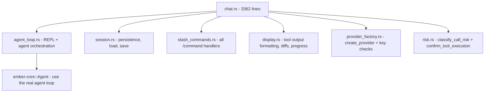
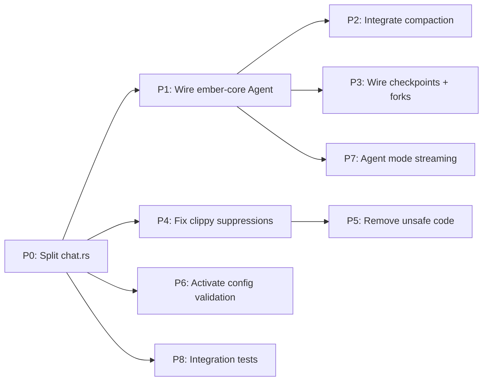

# 🔥 Ember — Code Review & Improvement Plan

## Executive Summary

After a thorough review of the entire Ember codebase (16 workspace crates, ~15k+ lines of core code), I've identified **10 concrete improvement areas** organized by severity. The single biggest issue is that the CLI reimplements the entire agent loop in a 3,362-line monolith (`chat.rs`) while ignoring the well-designed `Agent` struct in `ember-core`. Fixing this architectural inversion unlocks most other improvements.

---

## 🔴 Critical — Architectural Issues

### 1. `chat.rs` is a 3,362-line monolith that bypasses `ember-core::Agent`

**The Problem:**
- [`crates/ember-cli/src/commands/chat.rs`](crates/ember-cli/src/commands/chat.rs:1) contains the *entire* agent runtime: session persistence, REPL loop, tool execution, risk classification, progress indicators, slash commands, inline diffs, directory context building, and provider creation — all in one file.
- [`crates/ember-core/src/agent.rs`](crates/ember-core/src/agent.rs:294) defines a proper `Agent` struct with `StrategyTracker`, `ReflectionResult`, `AgentStep` enum (Think/Plan/Act/Observe/Reflect/Respond) — but **the CLI never uses it**. The only `ember_core` imports in `chat.rs` are [`SessionUsageTracker`](crates/ember-cli/src/commands/chat.rs:58) and [`RiskTier`](crates/ember-cli/src/commands/chat.rs:3054).
- This means all the sophisticated reasoning infrastructure in `ember-core` (compaction, checkpoints, session forking, strategy switching, context management) is dead code.

**The Fix — Decompose `chat.rs` into focused modules:**

**Files to change:**
- Split [`chat.rs`](crates/ember-cli/src/commands/chat.rs) into 6+ modules
- Wire [`agent_interactive()`](crates/ember-cli/src/commands/chat.rs:1895) to use [`Agent::chat()`](crates/ember-core/src/agent.rs:377)
- Move [`create_provider()`](crates/ember-cli/src/commands/chat.rs:824) to a shared provider factory module

### 2. `ember-core::Agent` has a complete agent loop that's never called

**The Problem:**
- [`Agent::chat()`](crates/ember-core/src/agent.rs:377) implements the full ReAct loop with tool execution, but is never invoked from the CLI.
- [`StrategyTracker`](crates/ember-core/src/agent.rs:124) with `should_switch_strategy()`, `suggest_alternative()`, and `reflect()` is fully implemented but unused.
- The CLI's [`agent_interactive()`](crates/ember-cli/src/commands/chat.rs:1895) reimplements a simpler version without reflection or strategy switching.

**The Fix:**
- Make `Agent` the single source of truth for the agent loop
- Add hooks/callbacks so the CLI can inject its display logic (progress spinner, inline diffs, tool confirmations) without reimplementing the loop
- Consider an `AgentEvents` trait or channel-based event system

### 3. Context compaction exists but is not integrated

**The Problem:**
- [`compaction.rs`](crates/ember-core/src/compaction.rs:1) (557 lines) has a complete implementation: `CompactionConfig`, `compact_conversation()`, `estimate_tokens()`, `should_compact()`
- The CLI's agent loop never checks if compaction is needed, never calls `compact_conversation()`
- Long conversations will hit the context window limit and fail silently

**The Fix:**
- In the agent loop, after each turn: check `should_compact()` → if true, run `compact_conversation()` → inject summary
- Expose compaction status to the user (e.g., "⚡ Compacted 12 turns, saved ~8k tokens")

---

## 🟠 High — Code Quality Issues

### 4. ~60 clippy `#[allow(...)]` directives suppress real warnings

**The Problem:**
- [`crates/ember-core/src/lib.rs`](crates/ember-core/src/lib.rs:33) has ~60 `#[allow(clippy::...)]` directives (lines 33-88)
- [`crates/ember-tools/src/lib.rs`](crates/ember-tools/src/lib.rs:26) has ~25 more
- These suppress legitimate warnings like `too_many_lines`, `cast_possible_truncation`, `unused_async`, `dead_code`
- This hides real code quality issues instead of fixing them

**The Fix:**
- Remove suppressions one-by-one and fix the underlying issues
- Keep only genuinely necessary ones (e.g., `module_name_repetitions` is a style choice)
- Priority removals: `dead_code`, `too_many_lines`, `unused_async`, `cast_possible_truncation`

### 5. Unsafe code in terminal manipulation

**The Problem:**
- [`suppress_echo()`](crates/ember-cli/src/commands/chat.rs:3306) uses `unsafe { libc::tcgetattr() / libc::tcsetattr() }` to control terminal echo
- [`drain_stdin()`](crates/ember-cli/src/commands/chat.rs:3332) uses `unsafe { libc::fcntl() }` for non-blocking stdin reads
- No error handling on the libc calls; failures are silently ignored
- Platform-specific (won't work on Windows)

**The Fix:**
- Replace with the `termion` or `crossterm` crate (already in the ecosystem for TUI)
- Add proper error handling with fallback behavior
- Make it cross-platform

### 6. Session ID generation uses timestamp+PID instead of UUID

**The Problem:**
- [`new_session_id()`](crates/ember-cli/src/commands/chat.rs:184) concatenates `SystemTime` seconds + process ID
- This is not collision-resistant (same second + PID reuse = collision)
- The rest of the codebase uses `uuid::Uuid::new_v4()` (checkpoints, forks, etc.)

**The Fix:**
- Replace with `Uuid::new_v4().to_string()` for consistency
- Already a dependency via `ember-core`

---

## 🟡 Medium — Security & Robustness

### 7. Gemini API key leaked in URL query parameter

**The Problem:**
- [`GeminiProvider::get_endpoint()`](crates/ember-llm/src/gemini.rs:96) constructs URLs like `https://...?key={api_key}`
- API keys in URLs get logged by proxies, CDNs, browser history, server access logs
- Other providers (Anthropic, OpenAI) correctly use HTTP headers

**The Fix:**
- This is actually how Google's Gemini API works (query param is their documented approach)
- Add a warning comment explaining this is by Google's design
- Consider supporting the `x-goog-api-key` header as an alternative (Google supports both)
- Ensure the URL is never logged (check tracing/debug output)

### 8. Config validation framework is dead code

**The Problem:**
- [`crates/ember-cli/src/config.rs`](crates/ember-cli/src/config.rs:12) has a sophisticated `ConfigValidationError`/`ConfigValidationWarning`/`ValidationResult` system with 30+ unit tests
- The `validate()` method exists but most validation structs are marked `#[allow(dead_code)]`
- Config validation is not called during startup

**The Fix:**
- Call `config.validate()` during app startup in [`run()`](crates/ember-cli/src/main.rs:772)
- Show warnings to the user (yellow text) and errors (red text + exit)
- Remove `#[allow(dead_code)]` once integrated

---

## 🔵 Low — Feature Completeness

### 9. Multiple advertised features are stubs

**The Problem (features listed in README but not wired up):**

| Feature | Status | Location |
|---------|--------|----------|
| `/checkpoint` | Core impl exists, CLI stub | [`checkpoint.rs`](crates/ember-core/src/checkpoint.rs) — 493 lines, never called from CLI |
| `/fork` | Core impl exists, CLI stub | [`session_fork.rs`](crates/ember-core/src/session_fork.rs) — 386 lines, never called from CLI |
| `/bench` | CLI impl exists, untested | [`bench_models()`](crates/ember-cli/src/commands/chat.rs:3224) exists |
| `/learn` | Core impl exists, not wired | [`ember-learn`](crates/ember-learn/src/lib.rs) crate exists, not used in CLI |
| Streaming in agent mode | Missing | Only [`one_shot_chat()`](crates/ember-cli/src/commands/chat.rs:2445) streams; agent mode uses non-streaming `complete()` |
| Context management | Partial | [`compaction.rs`](crates/ember-core/src/compaction.rs) exists but not called |

**The Fix:**
- Wire checkpoint/fork/learn through the agent loop
- Add streaming support to the agent loop (SSE chunks during tool-use iterations)
- Audit README and remove/mark features that don't work yet

### 10. No integration tests for the agent loop

**The Problem:**
- 134 `#[cfg(test)]` modules exist across crates (good unit test coverage)
- But NO integration test exercises the actual agent loop end-to-end
- The `tests/` directory at root is empty
- The `ember-llm` crate has a [`MockProvider`](crates/ember-llm/src/mock.rs) that could be used for integration tests

**The Fix:**
- Create integration tests using `MockProvider` that exercise:
  - Single-turn chat (no tools)
  - Multi-turn chat with tool calls
  - Tool failure → strategy switch
  - Context compaction trigger
  - Session save/load roundtrip

---

## Implementation Priority

### Recommended execution order:

1. **Split `chat.rs`** — decompose into 6 focused modules (unblocks everything)
2. **Wire `ember-core::Agent`** — make the CLI use the real agent loop
3. **Integrate compaction** — prevent context window overflow
4. **Fix clippy suppressions** — address real code quality issues
5. **Replace unsafe terminal code** — use crossterm/termion
6. **Activate config validation** — call `validate()` on startup
7. **Wire checkpoint/fork/learn** — connect existing core impls to CLI
8. **Add agent-mode streaming** — SSE during tool iterations
9. **Add integration tests** — end-to-end agent loop tests with MockProvider
10. **Fix session ID generation** — trivial UUID swap

---

## Key Metrics to Track

| Metric | Current | Target |
|--------|---------|--------|
| `chat.rs` line count | 3,362 | < 500 (main module) |
| Clippy suppressions | ~85 | < 15 |
| `unsafe` blocks | 2 | 0 |
| `ember-core::Agent` usage | 0 call sites | All agent loops |
| Integration test count | 0 | 10+ |
| Dead code modules | ~8 | 0 |
